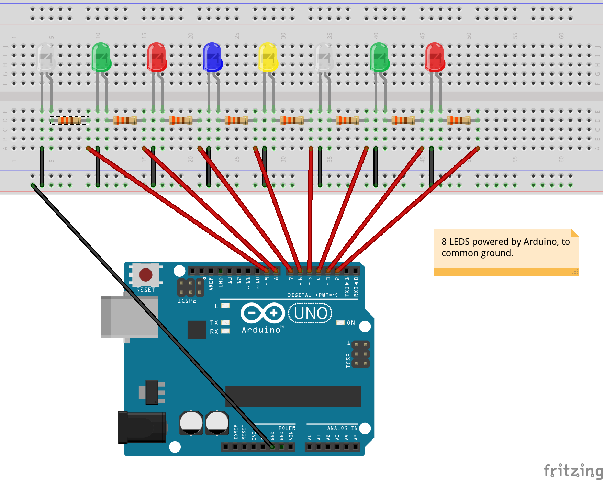
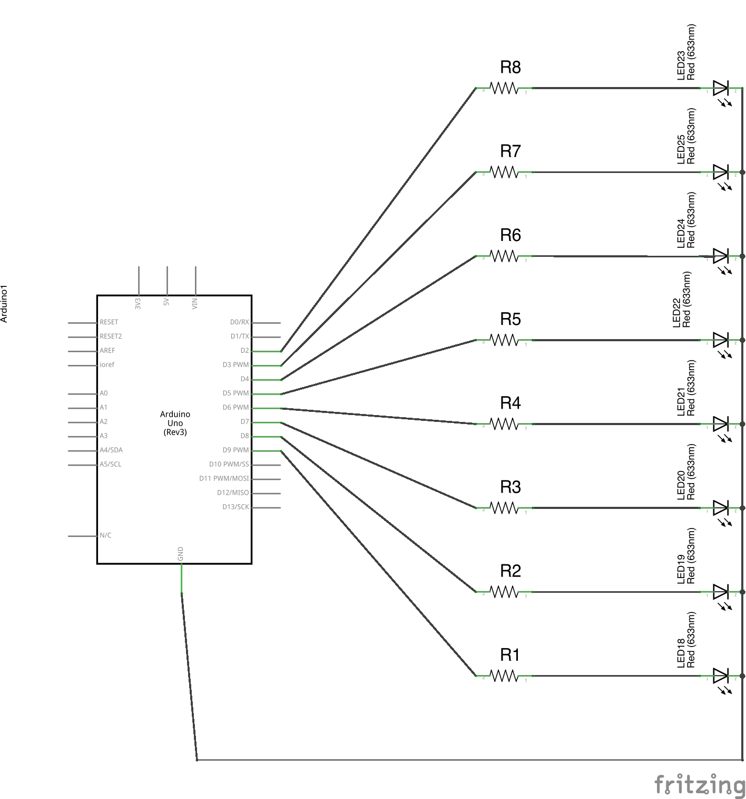

# Many LEDs

In this lab, you'll play with 8 LEDs in a row. Each LED can represent a "bit" and together form an 8 bit byte. You can use this array to show levels, for example, to show how loud an amplifier is, or to indicate the temperature.

1.  Start with the following circuit. Make sure to orient the LED correctly -- the flat side should be on top as in the diagram below. Connect the LED legs to pins 2 through 9 respectively:

     

    The LEDs can be arranged in any color combination you choose. For example, you could emulate a signal meter that is green until you get to a certain level, and then turns red.  

2.  Write code to turn all the LEDs on, then turn them all off.
    <%= EightLEDsStart.ino =%>
3.  Now turn them on one at a time from one end to the other, and then off one at a time from one end to the other.

4.  Using this code you can create a "Knight Rider" like chase from one end to the other.
    <%= EightLEDsKnightRider1.ino =%>
5.  But as you can see, it does not scale well... If you doubled the LEDs you'd double the size of your code, and modifications are tedious.
    Instead create an array with containing 8 bits. You can think of an array as a set of drawers (Indexes) numbered 0 through 7. You can then store a 1 or a 0 in each of the indicies... and when you "draw" the array to the set of LEDs they turn on when the index = high (1) or low (0).
    <%= EightLEDsKnightRider2.ino =%>
6.  Use `analogRead` on pins `A0` to set the delay values. Note that `analogRead` returns a number between `0` and `1023`.
    <%= EightLEDsPotSpeed.ino =%>
7.  Use `analogRead` on pins `A0`, `A1`, respectively, to set the values. Note that `analogRead` returns a number between `0` and `1023`. Divide them by 128 to get values from 0 to 7 from each pin.

8.  Use the potentiometer to make a level meter... lighting more LEDs as you rotate the potentiometer.
    <%= EightLEDsPotLevel.ino =%>
9.  Modify your code to use [the `map` function](http://arduino.cc/en/Reference/map) to convert the input value to the output value, instead of dividing by 128.

## Challenges:
1.  Experiment with turning potentiometers to create dark margins on the left and right that get narrower and wider as you turn the pots. 
2.  Use `random()` or another algorithm to slowly move a single "pixel?"
3.  Connect a button to a digital input pin.
    - Instead of moving LEDs with the potentiometers, increase the count whenever the button is pressed.
4.  Look at this version of the code... why do you think they wrote it this way?
    <%= EightLEDsKnightRider3Bonus.ino =%>
