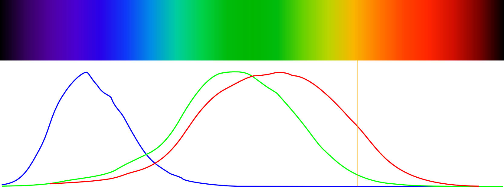
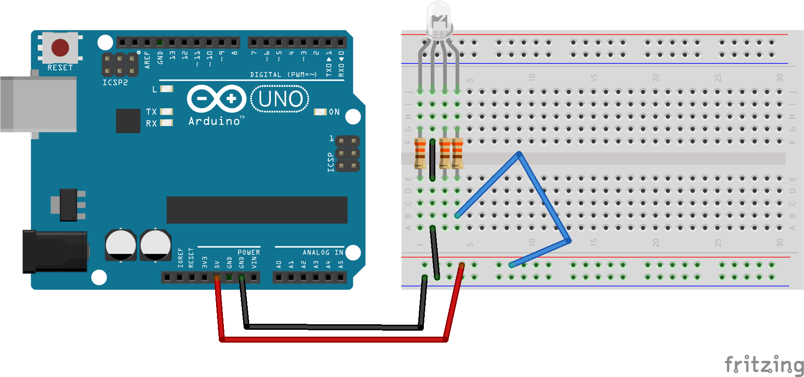
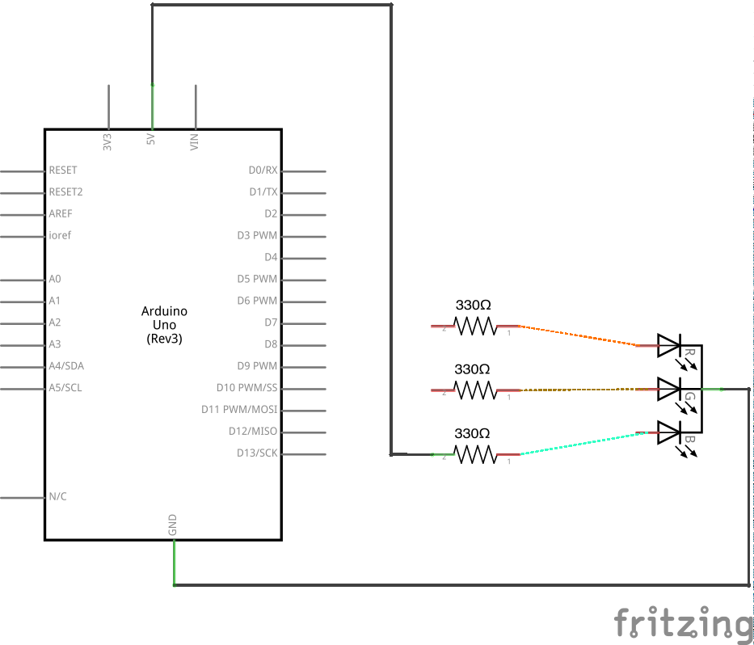
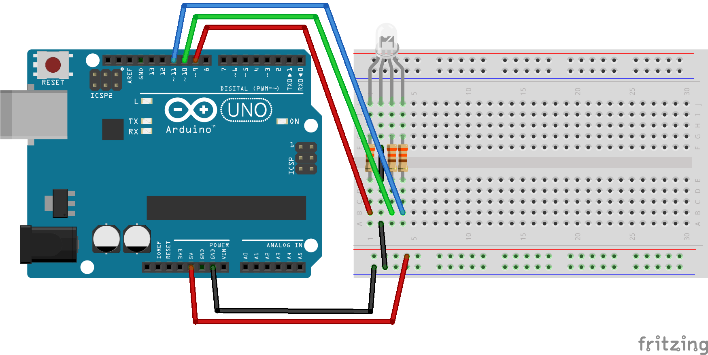
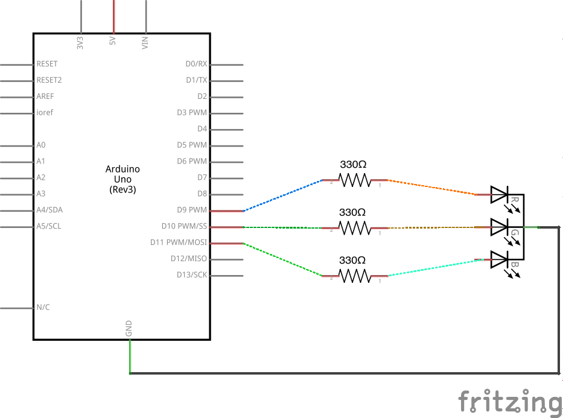
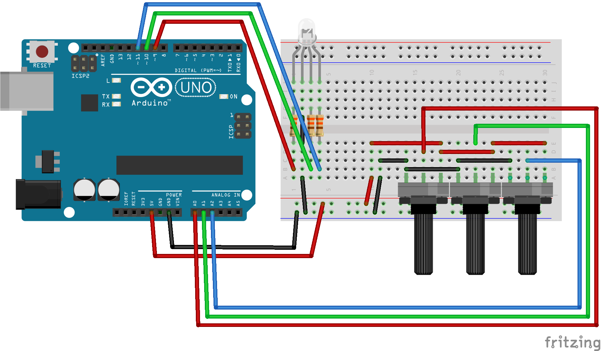
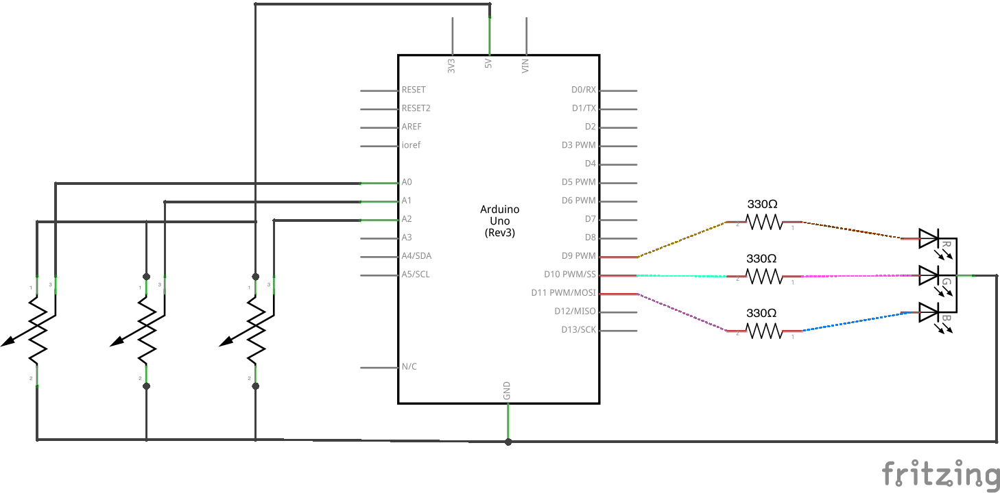

# Exploring Color

An RGB LED works like a computer screen; it relies on how your eye detects color. Your eye has three types of color-sensitive cells (called *cones*). Each type is most sensitive to a particular color of light: red light, green light, and blue light. We perceive different relative proportions of those colors as different colors. For example, yellow light triggers the red- and green-sensitive cells in a certain proportion, and we perceive yellow light. That fact allows us to fake "yellow" by producing red and green in that same proportion. An RGB LED lets us produce approximately any color we want by varying the red, green, and blue channels individually. In this lab, you'll play with colors and explore this effect.

1.  Start with the following circuit. Make sure to orient the LED correctly -- the flat side should be on the left as in the diagram below.

     

2.  The LED should appear blue. Take the end of the wire connected to the LED's resistor and move it between the red, green, and blue positions. Observe the LED's color change.

3.  Connect the red, green, and blue legs of the LED to pins 9, 10, and 11, respectively:

     

4.  Write code to get these colors in this sequence: red, green, blue, red *and* green (should make yellow), green *and* blue (should make cyan), blue *and* red (should make magenta), and finally red, green, *and* blue (should make white).
    <%= sequence.ino =%>
5.  Notice that the mixed colors are not very accurate -- in fact, the proportions are pretty far off! How can we fix this?

6.  You can adjust the brightness of an LED, and of a single color "channel" in your RGB LED, by using `analogWrite` instead of `digitalWrite`. `analogWrite` blinks very quickly (faster than you can perceive) and can simulate different brightness levels by sending specially timed pulses. This particular type of pulse pattern is called "pulse-width modulation" (PWM); only the pins marked with `~` support it.

    Modify your sequence code to reduce the brightness of the green channel wherever it is used. You may find the [reference for the `analogWrite` function](http://arduino.cc/en/Reference/AnalogWrite) helpful, especially the example code. Can you get a convincing orange color?

7.  Uploading new code to see the effects of new arguments to `analogWrite` is tedious. Instead, use a potentiometer to control the brightness of each color. Connect three potentiometers to analog pins `A0`, `A1`, and `A2`.

     

8.  Use `analogRead` on pins `A0`, `A1`, and `A2`, respectively, to set the value for `analogWrite` on `redPin`, `greenPin`, and `bluePin`. Note that `analogRead` returns a number between `0` and `1023`, while `analogWrite` requires a number between `0` and `255`. To convert the input value to the output value, you can simply divide by `4`. In case you get stuck, here's a possible set of code:
    <%= analogRead_to_analogWrite.ino =%>
9.  Turn all the potentiometers to 0. You should observe the LED off.

10. Modify your code to use [the `map` function](http://arduino.cc/en/Reference/map) to convert the input value to the output value, instead of dividing by 4.

11. Experiment by turning the red and green potentiometers to get a convincing orange color. (Try full red and a little green?) Can you get teal? Purple? What about gray?

12. In the next few steps, you'll modify your code so that turning all three potentiometers fully on produces a nice white color.

    To start, adjust all three potentiometers to get as nice a white color as you can.

12. Use `Serial.println` to send the values used in `analogWrite` to the serial monitor. (The code provided above does this for you.) Open the serial monitor and note which values for red, green, and blue produce the most compelling white color. 

    The goal is to change your code so that the comelling white color is the "maximum" value you get when you turn all the potentiometers all the way on. Say the nice white color occurs when you send (255, 140, 40) via `analogWrite` to the red, green, and blue pins, respectively. In that case, you'd want a fully on potentiometer for the blue channel to do `analogWrite(bluePin, 40)`.

13. Write a function called `setAdjustedColor` that uses [the `map` function](http://arduino.cc/en/Reference/map) to convert the range of each color channel (0 - 255) to the range for analog output for each color channel (0 - max for that color channel).

    Here's a snippet to get you started:

        //codeExt=ino
        // redValue, greenValue, and blueValue range from 0 to 255.
        void setAdjustedColor(int redValue, int greenValue, int blueValue) {
          // convert values with map
          // write values with analogWrite
        }

14. Use your new `setAdjustedColor` function to set the LED's color based on the three analog input values. Verify that the LED is white when the three potentiometers are rotated fully to the right. Your code might look something like this:
    <%= adjusted_color.ino =%>
15. Setting the red, green, and blue components is common, but not always the most useful way to think about color. For example, you may want a bright, saturdated color, but let someone modify the hue. That's what the Hue Saturation Brightness (HSB) color representation does. Instead of specifying red, green, and blue components of a color, you can specify a hue, a saturation, and a brightness.

    Converting from HSB to RGB is tricky, but here's a function that uses the `setAdjustedColor` function you wrote to set colors in HSB. Use it to make the analog inputs `A0`, `A1`, and `A2` control the hue, saturation, and brightness:
    <%= set_color_hsb.ino =%>

## Challenges:
1.  Use `random()` or another algorithm to slowly cycle through colors.
2.  Connect a button to a digital input pin.
    - Instead of changing the color with the potentiometers, increase the hue whenever the button is pressed, keeping full brightness and saturation. 
    - Modify the code so that the color of the LED doesn't change when the potentiometers are rotated, but only when the button is pressed.
    - Instead of using a button, try using the [CapSense library](http://playground.arduino.cc/Main/CapacitiveSensor) and a piece of copper foil. (For example, you could use this in a lamp that changes color by touch.)
